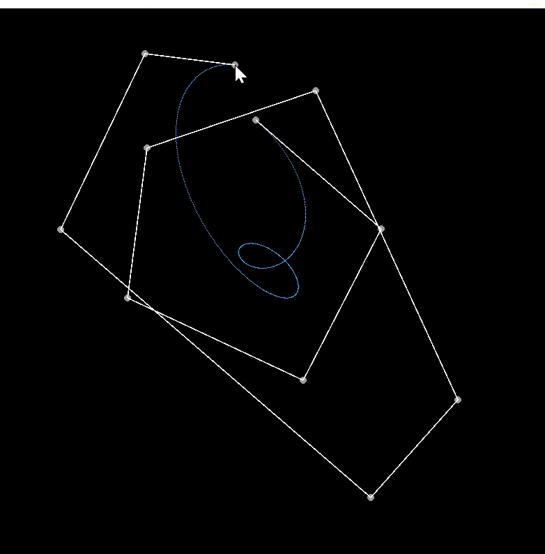

# Work3
# Bezier Curve 贝塞尔曲线绘制

基于 Taichi 实现的交互式贝塞尔曲线绘制程序，支持鼠标添加控制点、实时绘制曲线。

## 功能
- 鼠标左键点击添加控制点
- 自动生成平滑贝塞尔曲线
- 显示控制点与辅助连线
- 按 C 键清空画布

## 运行环境
- Python 3.12
- Taichi
- NumPy

## 运行演示
鼠标点击页面形成曲线


按c键清除页面


## 运行方式
```bash
python main.py


