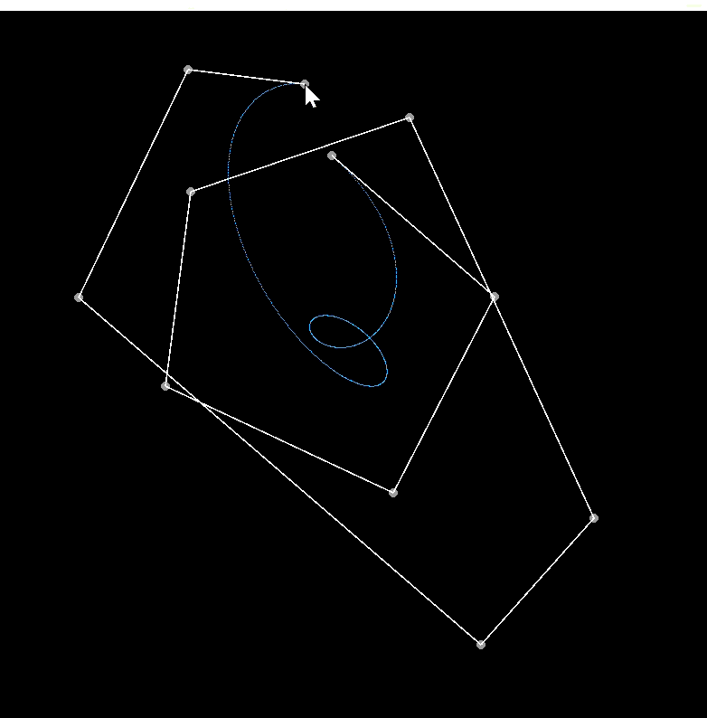

# Work3
# Bezier Curve 贝塞尔曲线绘制
苏文丽 202411081022

基于 Taichi 实现的交互式贝塞尔曲线绘制程序，支持鼠标添加控制点、实时绘制曲线。


## 功能
- 鼠标左键点击添加控制点
- 自动生成平滑贝塞尔曲线
- 显示控制点与辅助连线
- 按 C 键清空画布

## 运行环境
- Python 3.12
- Taichi
- NumPy

## 运行演示
鼠标点击页面形成曲线


按c键清除页面


## 曲线渲染拓展实验（选做）
## 1. 反走样（抗锯齿）贝塞尔曲线
### 原理
基础光栅化取整会产生阶梯状走样；利用亚像素浮点坐标，对几何点周边像素邻域加权混合，实现平滑边缘。
### 实现思路
1. 保留曲线浮点亚像素坐标
2. 取点周围3×3像素邻域
3. 根据像素中心与几何点距离分配透明度/颜色权重
4. 多像素混合渲染消除锯齿阶梯

## 2. 均匀三次B样条曲线
### 贝塞尔缺陷
- 全局控制：单个控制点改动影响整条曲线
- 控制点数量绑定多项式阶数，多点易计算不稳定
### B样条优势
局部控制、阶数固定，可自由增加控制点
### 实现逻辑
1. 公式：$P(t) = \sum_{i=0}^{n} P_i N_{i,p}(t)$，采用Cox-de Boor递归计算基函数
2. 简化方案：均匀三次B样条，每4个控制点生成一段曲线，使用固定基矩阵求值
3. 分段拼接：$n$个控制点生成$n-3$段平滑曲线
4. 交互切换：按下`b`键切换贝塞尔 / B样条渲染模式

### 对比观测
增加4个以上控制点，对比两种曲线形态；局部密集加点验证B样条局部控制特性。

## 运行方式
```bash
python main.py


